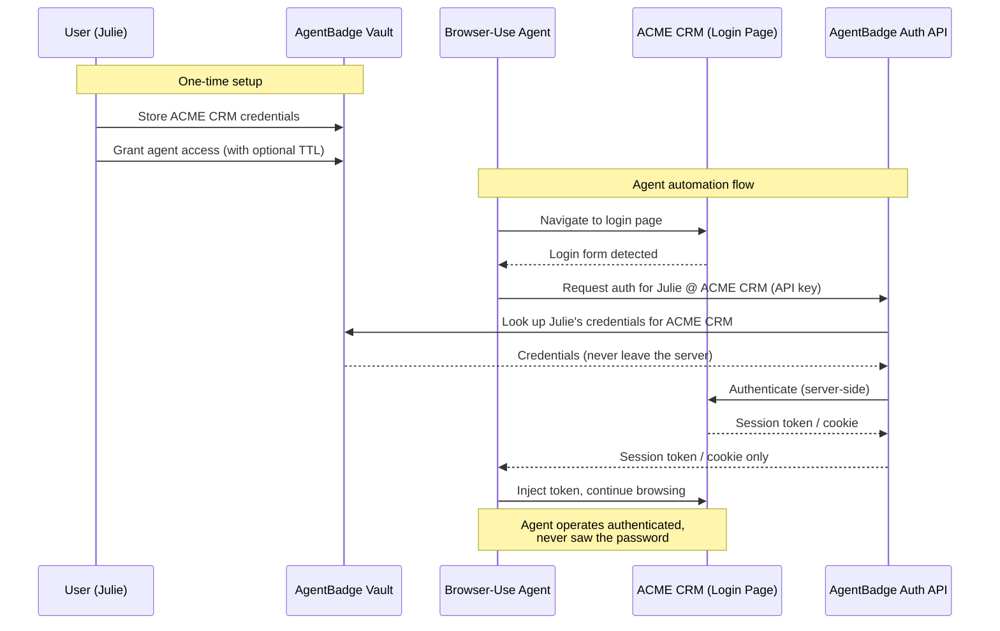

# AgentBadge

Secure credential proxy for AI agents. AgentBadge lets users authorize browser-use agents to access protected resources **without ever exposing their credentials to the LLM**.

## The Problem

AI agents automating browser tasks (e.g. via browser-use, Playwright, Puppeteer) need to log into web apps on behalf of users. Passing raw credentials (username/password) to the agent means exposing them to the LLM and any intermediary systems -- a serious security risk.

## How It Works

AgentBadge acts as a trusted, self-hosted authentication proxy. Users store their credentials once in AgentBadge's vault. When an agent needs to log in, it calls AgentBadge's auth API (via WebMCP or direct API) to authenticate -- receiving only a session token/cookie, never the raw credentials.



### Key Security Properties

- **Credentials never reach the LLM** -- they stay in the AgentBadge vault
- **Agents only receive session tokens** -- short-lived, scoped, revocable
- **Users control access duration** -- infinite or preset TTL per authorization
- **Self-hosted** -- your credentials stay on your infrastructure

## Project Structure

```
packages/
  crm-mock/       # Mock CRM app for testing (username/password auth)
  saas/           # AgentBadge management dashboard (vault, agents, activity)
  agent/          # Agent automation scripts (badge-way vs old-way comparison)
src/              # Badge playground & API tester
```

## Getting Started

```bash
bun install
```

### Development

```bash
bun dev
```

### Production

```bash
bun start
```

## Roadmap

- **Passwordless auth** -- OTP-based flow where the agent requests a one-time code through AgentBadge
- **OAuth support** -- Proxy OAuth flows so agents can access OAuth-protected resources without handling tokens directly
- **Enterprise IdP integration** -- Connect with Okta, Auth0, and other identity providers for SSO-based agent authentication
